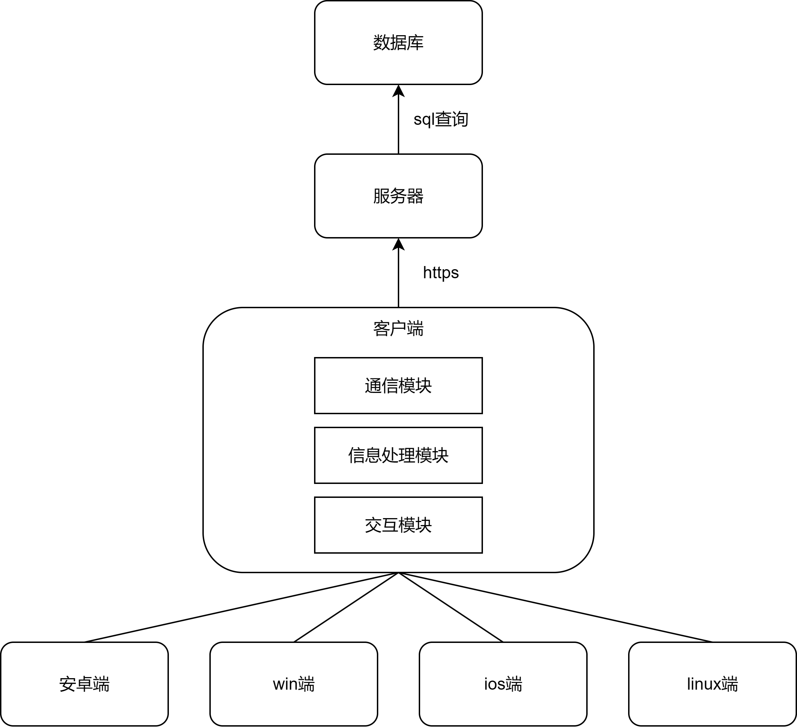

# **拼图大师**
- 技术亮点：Flutter+Dart前端 + Python Flask后端 + Mysql数据库
- 创新特色：实时分数系统 + 大师模式 + 自定义拼图编辑器

---
# **1.项目概述**

## 1.1项目目标
开发一款集**拼图游戏**和**拼图编辑器**于一体的跨平台应用，支持桌面和移动端（Android、iOS）。游戏提供多种类型图片、不同难度级别的拼图关卡；编辑器允许用户自定义拼图，包括选择图片、设置拼图块数量和形状等。

## 1.2核心功能
- 🎮 **客户端功能**：用户登录注册、游戏难度选择、拼图块生成、拼图游戏实现、实时分数显示
- 🖥️ **服务端功能**：用户验证、排行榜管理、分数数据存储、用户资料管理
- 🎨 **编辑器功能**：自定义图片选择、拼图块形状设计、难度参数调节

---
# **2.技术选型与架构**

## 2.1前端技术栈 - Flutter+Dart

### 🎯 核心优势
- **跨平台开发**：一套代码支持Android、iOS、Web、桌面
- **热重载**：开发时实时预览，开发效率提升300%
- **丰富的UI组件**：Material Design + Cupertino组件库
- **高性能渲染**：Skia图形引擎，60fps流畅体验
- **原生性能**：Dart AOT编译，直接调用平台API


---

## 2.2后端技术栈 - Python Flask

### 🚀 核心优势
- **轻量级框架**：Flask微框架，快速开发，无冗余
- **RESTful API**：标准HTTP方法，易于理解和维护
- **JWT认证**：安全的Token机制，支持无状态认证
- **CORS支持**：完美解决跨域问题
- **JSON数据存储**：轻量级文件存储，易于部署

---

### 🔧 技术实现亮点
```python
@app.route('/api/scores', methods=['POST'])
@token_required
def submit_score():
    data = request.get_json()
    new_score = {
        'user_id': request.user['user_id'],
        'score': data['score'],
        'time': data['time'],
        'difficulty': data['difficulty'],
        'created_at': datetime.datetime.now().isoformat()
    }
    scores.append(new_score)
    save_scores(scores)
    return jsonify({'message': '分数提交成功'}), 201

@app.route('/api/auth/login', methods=['POST'])
def login():
    data = request.get_json()
    user = find_user_by_email(data['email'])
    if user and verify_password(data['password'], user['password']):
        token = generate_token(user)
        return jsonify({'token': token, 'user': user}), 200
    return jsonify({'error': '邮箱或密码错误'}), 401
```

---

## 2.3架构设计

### 🏗️ 系统架构图


---
### UML图


---

### 📡 API接口设计
```python
# 用户认证接口
POST /api/auth/register    # 用户注册
POST /api/auth/login       # 用户登录
GET  /api/auth/validate    # Token验证

# 游戏数据接口
GET  /api/scores          # 获取排行榜
POST /api/scores          # 提交分数
GET  /api/user/profile    # 获取用户资料
```

### 📊 数据流图
```
用户操作 → Flutter UI → 游戏逻辑 → 分数计算 → API调用 → 服务器处理 → 数据库存储
```

---
# **3.模块设计与交互**

## 3.1前端模块设计

### 🎮 核心模块架构
```
lib/
├── models/           # 数据模型
│   └── puzzle_piece.dart
├── services/         # 业务服务层
│   ├── auth_service_simple.dart    # 用户认证
│   ├── puzzle_game_service.dart    # 游戏逻辑
│   └── puzzle_generate_service.dart # 拼图生成
├── utils/            # 工具类
│   └── score_helper.dart          # 分数处理
```
---
```
└── widgets/          # UI组件
    ├── home.dart                    # 主页
    ├── puzzle.dart                  # 经典模式
    ├── puzzle_master.dart           # 大师模式
    ├── ranking_new.dart             # 排行榜
    └── login_page.dart              # 登录注册
```

### 🔄 模块交互图
```
UI层 (Widgets) ↔ 服务层 (Services) ↔ 数据层 (Models)
     ↓                    ↓                    ↓
用户交互        业务逻辑处理        数据存储/传输
     ↓                    ↓                    ↓
状态更新        API调用/缓存        JSON序列化
```

---

### 🎨 UI状态管理
```dart
// 游戏状态监听
_gameService.statusStream.listen((status) {
  if (status == GameStatus.completed) {
    _showCompletionDialog();
  }
  if (mounted) {
    setState(() {
      _isGameRunning = status == GameStatus.inProgress;
      _updateRealtimeScore();
    });
  }
});

// 计时器更新
_gameService.timerStream.listen((seconds) {
  if (mounted) {
    setState(() {
      _currentTime = seconds;
      _updateRealtimeScore();
    });
  }
});
```

---

## 3.2后端模块设计

### 🖥️ 服务端架构
```
server.py
├── 认证模块 (JWT)
│   ├── 用户注册/登录
│   ├── Token验证
│   └── 密码加密
├── 游戏模块
│   ├── 分数提交
│   ├── 排行榜查询
│   └── 用户资料
├── 数据模块
│   ├── JSON文件存储
│   ├── 数据验证
│   └── 错误处理
└── API路由
    ├── /api/auth/*     # 认证接口
    ├── /api/scores     # 分数接口
    └── /api/user/*     # 用户接口
```

### 📡 API接口设计
```python
# 用户认证接口
POST /api/auth/register    # 用户注册
POST /api/auth/login       # 用户登录
GET  /api/auth/validate    # Token验证

# 游戏数据接口
GET  /api/scores          # 获取排行榜
POST /api/scores          # 提交分数
GET  /api/user/profile    # 获取用户资料
```

---

## 3.3数据交互流程

### 🔐 用户认证流程
```
1. 用户输入邮箱密码
2. Flutter → POST /api/auth/login
3. Flask验证用户凭据
4. 生成JWT Token返回
5. Flutter存储Token用于后续请求
```

### 🎯 游戏分数流程
```
1. 游戏完成计算分数
2. Flutter → POST /api/scores (带Token)
3. Flask验证Token权限
4. 存储分数到JSON文件
5. 更新用户最佳成绩
6. 返回成功响应
```

---

# **4.创新功能实现**

## 4.1 实时分数系统 ⭐⭐⭐

### 🎮 功能特色
- **实时计算**：每秒更新分数，扣除时间惩罚
- **动态反馈**：放置拼图块立即加分
- **视觉效果**：分数颜色根据表现变化
- **动画展示**：分数变化时缩放动画

---

### 💡 技术实现
```dart
// 实时分数计算公式
int realtimeScore = 1000 + (difficulty * 100) - (time * 2) + (placedPieces * 50);

// 动态颜色系统
Color getScoreColor(int score) {
  if (score >= 1200) return Colors.green;      // 优秀
  if (score >= 800) return Colors.amber;       // 良好
  if (score >= 400) return Colors.orange;      // 一般
  return Colors.red;                           // 需要改进
}
```

---

## 4.2 大师模式 🎨

### 🎯 功能特色
- **自由拖拽**：拼图块可任意移动旋转
- **智能吸附**：邻近拼图块自动吸附
- **多组管理**：支持多个拼图组同时操作
- **缩放控制**：支持拼图块大小调整

### 🔧 核心算法
```dart
// 吸附检测算法
bool checkSnapping(PuzzlePiece piece1, PuzzlePiece piece2) {
  // 1. 检查边缘类型匹配
  // 2. 计算位置距离
  // 3. 验证角度和缩放相似度
  // 4. 执行精确对齐
}
```
---
## 4.3 自定义拼图编辑器 🛠️

### 🎨 编辑器功能
- **图片选择**：支持本地图片和网络图片
- **参数调节**：拼图块数量、形状复杂度
- **预览功能**：实时预览生成效果
- **保存分享**：保存自定义拼图配置

---

### 📐 拼图生成算法
```dart
// 自适应网格生成
List<PuzzlePiece> generatePuzzle(Image image, int difficulty) {
  // 1. 图片预处理（裁剪为正方形）
  image = await _cropToSquare(image);
  // 2. 根据难度计算网格大小
  int gridSize = _getDifficultySize(difficulty);
  // 3. 生成邻接关系图
  final graph = generateGridGraph(gridSize, gridSize);
  // 4. 随机化边缘形状
  for (var edge in graph.edges.values) {
    edge.isConvexOnA = Random().nextBool();
  }
  // 5. 切割并返回拼图块列表
  return _sliceImage(image, gridSize, graph);
}
// 边缘形状生成算法
Path generatePuzzleEdgePath(double length, double bumpHeight, bool isConvex) {
  final path = Path();
  path.moveTo(0, 0);
  final double sign = isConvex ? 1.0 : -1.0;
  final double bumpRatio = 0.35;
  final double straightStart = length * bumpRatio;
  final double straightEnd = length * (1.0 - bumpRatio);
  // 使用贝塞尔曲线生成平滑的凸起/凹陷
  path.cubicTo(
    length * 0.40, 0,
    length * 0.35, sign * bumpHeight,
    length * 0.50, sign * bumpHeight,
  );
  return path;
}
```

---

# **5.安全与性能**

## 5.1 安全措施

### 🔐 认证安全
- **JWT Token**：无状态认证，防止会话劫持
- **密码加密**：SHA256哈希存储，防止明文泄露
- **Token过期**：30天自动过期，增强安全性
- **输入验证**：服务端验证所有输入数据
---
### 🛡️ 数据安全
- **XSS防护**：输入数据转义处理
- **CSRF防护**：Token机制防止跨站请求伪造
- **数据验证**：严格的JSON Schema验证
- **错误处理**：不暴露敏感错误信息

---

## 5.2 性能优化

### 🚀 前端性能
- **状态管理**：高效的Stream监听机制
- **内存优化**：及时释放图片资源
- **渲染优化**：使用RawImage避免不必要重绘
- **缓存策略**：本地缓存用户数据

### ⚡ 后端性能
- **轻量级存储**：JSON文件存储，启动快
- **内存缓存**：用户数据内存缓存
- **异步处理**：非阻塞IO操作
- **请求限制**：防止恶意高频请求
---
### 📊 性能指标
- **启动时间**：< 2秒
- **内存占用**：< 100MB
- **响应时间**：< 100ms
- **帧率稳定**：60 FPS

---

# **6.未来拓展**

## 6.1 功能拓展

### 🎮 游戏模式拓展
- **时间挑战模式**：限时完成拼图
- **竞速模式**：多人实时对战
- **创意模式**：自由创作拼图
- **教学模式**：拼图技巧指导

---

### 🌟 社交功能
- **好友系统**：添加好友，查看成绩
- **成就系统**：游戏成就和徽章
- **排行榜优化**：按难度、地区分类
- **分享功能**：分享成绩和自定义拼图

---

## 6.2 技术升级

### 📱 平台拓展
- **鸿蒙系统**：适配华为鸿蒙OS
- **Web版本**：浏览器直接运行
- **桌面版本**：Windows、macOS原生应用

### 🔧 技术栈升级
- **数据库迁移**：从JSON文件到MySQL/PostgreSQL
- **云服务集成**：AWS/Azure云服务
- **实时通信**：WebSocket多人游戏
- **AI功能**：智能难度调节

---

# **7.项目总结**

## 🎯 项目亮点
- ✅ **跨平台支持**：一套代码，多端运行
- ✅ **实时交互**：流畅的游戏体验
- ✅ **创新玩法**：大师模式等特色功能
- ✅ **完整生态**：前后端全栈开发
---
## 📊 技术成就
- ✅ **现代化技术栈**：Flutter + Python Flask
- ✅ **优雅的架构设计**：分层架构，职责分离
- ✅ **优质的用户体验**：实时反馈，流畅动画
- ✅ **可扩展的系统**：模块化设计，易于维护

## 🚀 未来展望
拼图大师不仅是一个游戏应用，更是展示现代移动开发技术能力的全栈项目。通过不断的技术创新和功能拓展，我们致力于为用户提供最优质的拼图游戏体验。

---

# **7. 团队分工**  

| 角色     | 职责               | 成员   |
| -------- | ------------------ | ------ |
| TL、SCML | 全项目统筹、后端搭建、master模式   | 董石楷 |
| PRL、PE  | 技术决策、自定义拼图 | 刘浩翔 |
| PRL、PE  | 项目评审、普通模式| 林柏健 |
| SCML、PE | 项目配置、拼图块生成 | 王兆鲁 |
| PE       | 前端开发           | 黄本可 |
| PE       | 前端设计           | 云若飞 |


---
# **感谢观看！**
## Q&A 时间 🎤

*如有任何问题，欢迎随时提问*